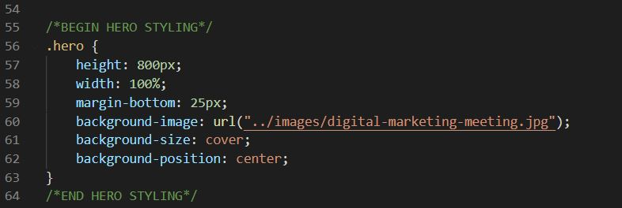

# Horiseon Website Challenge 1: Refactoring Code and Adding Accessability 

This code provides a website for a business called Horiseon that specializes in helping businesses grow their online presence. This code was created and needed refactored. The code needed to be adjusted to correct semantic HTML elements, give the CSS file a more logical structure, and increase accessibility. I built this project for practice in HTML and CSS and to learn how to spot and adjust code to make it more efficient. I learned it's easy to add too many classes and unneccessary lines in your code. Also, I learned to take my time and add more comments as I go instead of powering through the code until it was done. I feel my code is easy to read and easy to follow exactly what each section.
Please see website deployed at https://brinabean.github.io/Horiseon-refactored/

## Installation

To install the project, please clone all files from my Horiseon-Refactored repsoitory. After cloning, save this file under a unique name into a folder of your own that is easy to find. Next, open up VSC on your computer, go to "Open folder", go to the folder with all the files that you saved, and select that folder to open. After that you can click on the index.html and style.css files to open them in VSC from the side bar. You can then right click on anywhere in the index.html code and click on "Open in default browser" to bring up the website. 

## Usage

This code is used to develop a website that meets accessibility standards and optimizes the function and look of the Horiseon website. This code can also be used as an example or template to create code for different websites that may have similar designs. Below is a code for a basic HERO section for a website that can be the base for a much more complicated HERO in an updated version of this website or another website.

## Credits

The original code was downloaded from the Coding Boot Camp at Case Western Reserve University
    Repository: https://github.com/Brinabean/CWRU-VIRT-BO-FSF-PT-11-2021-U-B-/tree/master/01-HTML-Git-CSS/02-Challenge

## Liscense

MIT License

Copyright (c) 2021 Sabrina Zanin

Permission is hereby granted, free of charge, to any person obtaining a copy
of this software and associated documentation files (the "Software"), to deal
in the Software without restriction, including without limitation the rights
to use, copy, modify, merge, publish, distribute, sublicense, and/or sell
copies of the Software, and to permit persons to whom the Software is
furnished to do so, subject to the following conditions:

The above copyright notice and this permission notice shall be included in all
copies or substantial portions of the Software.

THE SOFTWARE IS PROVIDED "AS IS", WITHOUT WARRANTY OF ANY KIND, EXPRESS OR
IMPLIED, INCLUDING BUT NOT LIMITED TO THE WARRANTIES OF MERCHANTABILITY,
FITNESS FOR A PARTICULAR PURPOSE AND NONINFRINGEMENT. IN NO EVENT SHALL THE
AUTHORS OR COPYRIGHT HOLDERS BE LIABLE FOR ANY CLAIM, DAMAGES OR OTHER
LIABILITY, WHETHER IN AN ACTION OF CONTRACT, TORT OR OTHERWISE, ARISING FROM,
OUT OF OR IN CONNECTION WITH THE SOFTWARE OR THE USE OR OTHER DEALINGS IN THE
SOFTWARE.